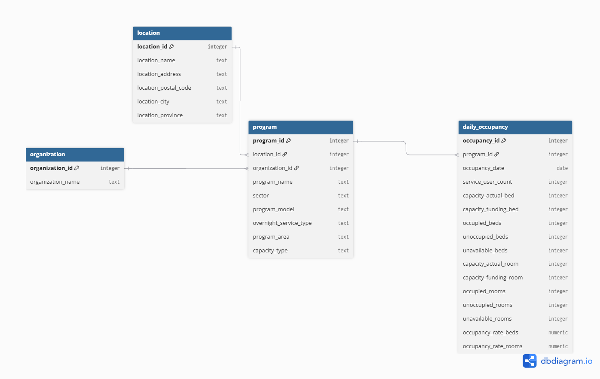

# Toronto Shelter System Occupancy — a relational analysis
 
Restructuring Toronto's daily shelter occupancy data into a normalized PostgreSQL database, then answering six operational questions with SQL.
 

 
## Business problem
 
The City of Toronto publishes shelter occupancy as a single flat daily file. Every row repeats the operating organization, the building address and the program details, which makes it difficult to ask questions about organizations, locations and programs as distinct things. This project restructures the data so those questions become answerable.
 
## Dataset
 
- **Source:** City of Toronto Open Data — Daily Shelter & Overnight Service Occupancy & Capacity
- **Licence:** Open Government Licence – Toronto
- **Date range:** 2025-01-01 to 2025-12-31
- **Downloaded:** August 11, 2026
The raw CSV is not committed to this repository. See [docs/DATA_SOURCE.md](docs/DATA_SOURCE.md).
 
## Tools
 
- PostgreSQL, hosted on Supabase
- DBeaver Community Edition
- dbdiagram.io for the entity relationship diagram
## Database design
 
Four tables. Organization and location are **independent parents** of program, which carries both foreign keys. This is deliberately not a chain, and the reason is the most interesting part of the project.
 
My first design placed `organization_id` on `location`, assuming each building belongs to one operator. The migration failed with a duplicate key violation: location 1125 had three different operating organizations with identical address details.
 
A building has an address. It does not have an operator. What has an operator is the program running inside it.
 
The full investigation is in [docs/modelling_decisions.md](docs/modelling_decisions.md).
 
| Table | Rows | Holds |
|---|---|---|
| organization | 40 | Operating agencies |
| location | 118 | Physical buildings |
| program | 188 | Services, linked to operator and building |
| daily_occupancy | 51,543 | One row per program per day |
 
See [docs/data_dictionary.md](docs/data_dictionary.md) for every column.
 
## Data preparation
 
1. The CSV was imported into a staging table with every column as text, so no row could fail on a type conversion during load.
2. Uniqueness and relationship assumptions were tested with diagnostic queries **before** any table was built.
3. Data was migrated into the normalized tables, parents first, with `NULLIF` guarding every numeric cast.
4. Seven validation checks confirmed row counts reconcile, no duplicate keys exist and no foreign keys are orphaned.
## Business questions
 
1. How many organizations, locations and programs are active, and how do programs split across sectors?
2. Which ten organizations operate the most programs?
3. How does system-wide bed occupancy move month to month?
4. Which programs sit above 95% occupancy on more than half their reported days?
5. How do locations rank by average occupancy within each sector?
6. Which programs show the sharpest month-over-month swing in occupied beds?
## Key findings
 
- 111 of the 148 bed-reporting programs ran at 95%+ occupancy on more than half their reported nights, and 33 held that on all 365. 15 of 17 Families programs report rooms, not beds, so they never enter a bed-based query at all. Their room occupancy averages 98.9%.
- System-wide bed occupancy never fell below 96.3% in any month of 2025 and averaged 97.4% across the year, so the system had no slack season.
- Capacity, not demand, drives the monthly rate: between October and December the number of programs reporting rose from 100 to 132 and occupied bed-nights rose by roughly 14,000, while the occupancy rate fell 1.7 points.
## Recommendation
 
Prioritize ways to add or free up shelter bed capacity, especially in programs that are consistently above 95% occupancy.
 
## Limitations
 
- Analysis covers a single year. Patterns found are not established as general.
- Program 18891 relocated between locations mid-year. The schema records one location per program, so only its final site appears.
- Locations 1761 and 1155 appear to be the same building at 4584 Kingston Road, recorded twice across a rename. Both were retained because the source recorded them separately.
- The data reflects what was reported. Variation in reporting practice between operators would be indistinguishable from real variation.

   Part of a series of three projects on Toronto open data, each built
   around validating a result and chasing the gap to its cause. Project
   two reconciled Excel counts against published police figures to
   within 0.15%:
   https://github.com/K45K0diak/toronto-crime-excel-analysis
   Project three benchmarked an LLM against a deterministic rule and
   recommended the rule:
   https://github.com/K45K0diak/toronto-crime-llm-benchmark

## How to reproduce
 
1. Download the dataset — see [docs/DATA_SOURCE.md](docs/DATA_SOURCE.md).
2. Run `sql/01_create_staging.sql`, then import the CSV into `staging_shelter`.
3. Run `sql/02_create_tables.sql`.
4. Run `sql/03_migration.sql`.
5. Run `sql/04_validation.sql` and confirm the expected results.
6. Analysis queries are in `sql/analysis/`.
## Contact
 
Chinazam Okere-Olujie — [GitHub](https://github.com/K45K0diak) · [LinkedIn](https://www.linkedin.com/in/chinazam-okere-olujie-a28511258)
